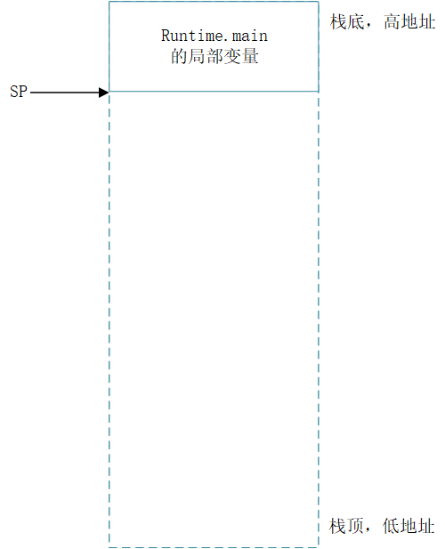
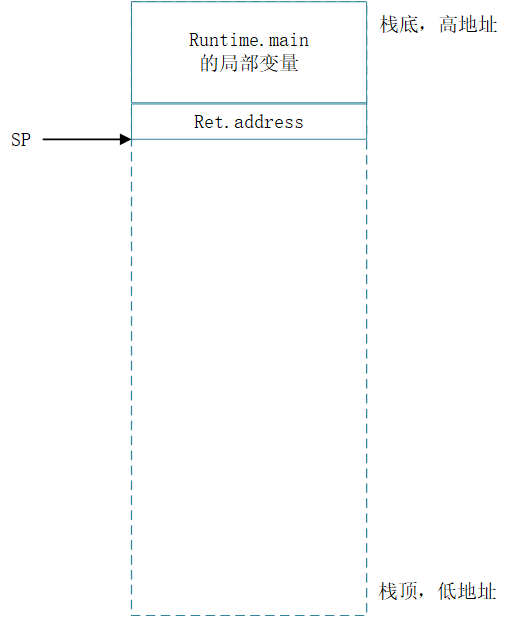
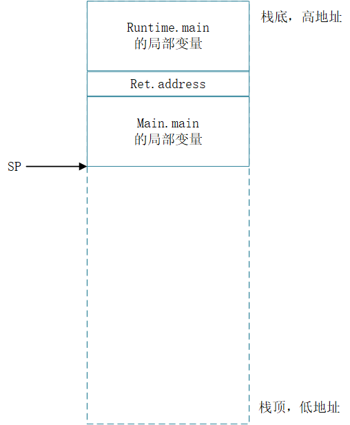
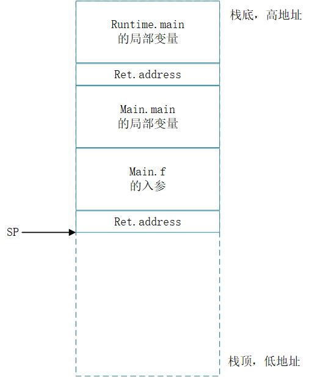
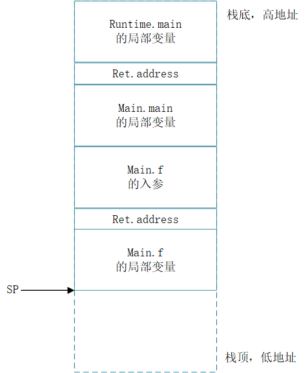
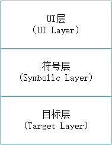
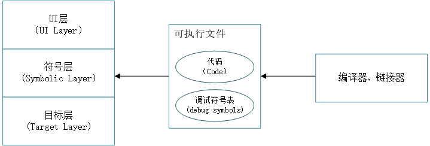
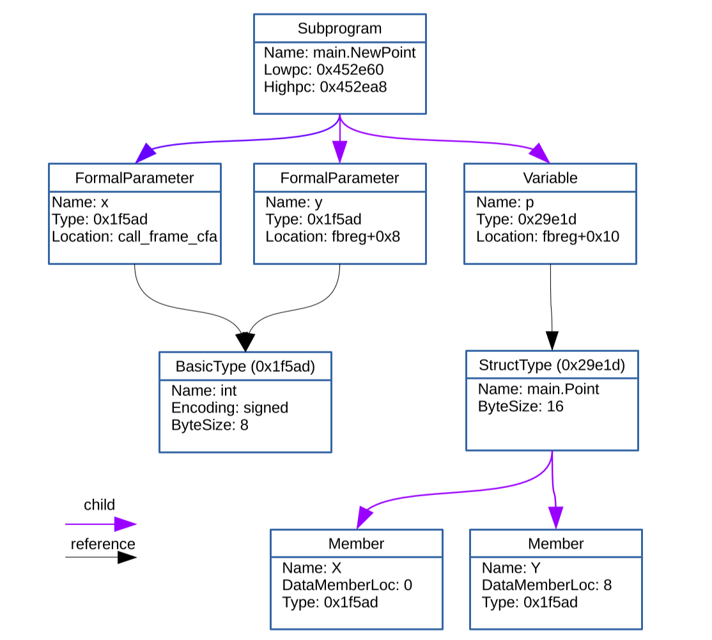

# DELVE 内部架构

## Delve是什么

- Delve

  - Delve是一个Go语言的 symbolic debugger 符号调试器

    - 带有调试符号表，可以进行源代码级调试

    https://github.com/go-delve/delve

  - 使用Delve作为调试器的工具：GoLand IDE，VSCode Go，vim-go

- 这篇文章关于

  - 一个关于delve架构的总体概述

  - 解释为什么其他的调试器难以调试Go语言

    
## 大纲
- 汇编基础

- Delve架构

- 一些Delve功能的实现

  

## 汇编基础

### CPU

- 计算机拥有一个或者多个CPU

- 每个CPU都有寄存器，通常来说
  - Program Counter 程序计数器（PC）：保存下一条将要执行的指令在主存储器中的地址
    - 也称为Instruction Pointer 指令指针寄存器（IP）
  - Stack Pointer 栈指针寄存器（SP）：保存调用栈的栈顶地址- 

- CPU以类似下面方式执行汇编指令：

  ```assembly
  MOVQ DX, 0x58(SP) 
  ```

  MOVQ（Move Quadword）：用于将一个值（64位）写入某个寄存器

  DX 数据寄存器（16位）

  所以整个指令代表将 栈顶的地址（SP的值）写入到DX寄存器中。

  <font color=red>Q：MOVQ移动64位数据，但是DX是一个16位寄存器，是不是又问题？</font>
  
  

## 调用栈

- 函数调用栈为函数调用保存参数，局部变量和返回地址（函数调用后的下一条指令，即函数调用语句的下一条可执行语句的地址）

### 函数调用过程

图例： 

虚线框：已申请的栈空间

实线框：已使用的栈空间

1. runtime.main函数调用goroutine 1 

   

2. runtine.main 将返回地址压栈，调用main.main函数（即用户写的main包的main函数）

   

3. main.main函数将自己的局部变量压栈

   

4. 当main.main函数调用其他函数（比如main.f）:
   - 将main.f的参数压栈

   - 将返回地址压栈

     

5. 最后将main.f的局部变量压栈

   

<font color=red>Q:为什么返回地址是在参数与局部变量之间？按理说，应该是发挥地址在栈底，然后是参数，再是局部变量？</font>


## 线程与协程goroutine

### M:N 线程模型 / 绿色线程Green thread

- M 个goroutine 在 N个线程上协作调度

- N 初始等于$GOMAXPROCS（默认是CPU的核数）

###  与线程的区别

- goroutine是协作调度，不同于线程需要进入内核上下文切换
- goroutine 开始的时候栈很小（默认只有2k），在执行过程中，栈可以动态增长或者收缩

### 当一个go 函数被调用时

- 首先检查栈上是否有足够的空间能够保存函数的局部变量
- 如果栈上的空间不足，则调用runtime.morestack_noctxt
- runtime.morestack_noctxt 为栈申请更多的空间
- 如果当前栈想要扩展的内存区域（一般是栈顶往低地址方向的内存）已经被使用，那么**栈会被拷贝到内存的其他地方，然后在扩大栈空间**

### goroutine 栈是可以在内存中移动的

- 调试器通常假设栈是不可以在内存中移动的

  

## Delve 架构



### 一个源码级调试器的架构

UI 层： 提供人机交互界面

符号层（Symbolic Layer）：可以获取行号，类型，变量名等

目标层（Target Layer）：控制目标进程，但是对于你的源码一无所知

### 目标层的功能

- 附加（attach）到目标进程，或者从目标进程卸载（detach）
- 能够枚举处目标进程的所有线程
- 能够启动/停止独立的线程（或者整个进程）
- 接收“调试事件(debug events)” （比如线程创建、销毁，还有更重要的线程在断点处停止的事件）
- 能够读写目标进程的内存
- 能够读写一个已停止的线程的CPU寄存器
  - 实际上，这个CPU寄存器的数据保存在系统调度器的线程描述符中	

### Delve的目标层

目标层有3个重要的实现

#### pkg/proc/native

- 通过系统API调用来控制目标进程：
  - Windows
    
    -  WaitForDebugEvent, ContinueDebugEvent, SuspendThread...
  - Linux
    
  	- ptrace, waitpid, tgkill..
    
  - macOS
    
    - notification/exception ports, ptrace, mach_vm_region…
  
- native作为Windows和Linux上的默认后端，macOS则是debugserver


#### pkg/proc/core：

- 读取linux_amd64核心文件

#### pkg/proc/gdbserial：

- 用来连接各种调试器服务

  - macOS上的debugserver（macOS上默认启动）

  - lldb-server

  - Mozilla RR（一个<font color=red>时间旅行调试器 ???</font>后端，仅适用于linux / amd64）

    关于TimeTravelDebugger，允许反向调试，主要基于record / replay，不断增量记录程序的当前运行状态，以便事后可以查询并恢复到当时记录的状态。

- gdbserial名称来自它所使用的协议，即Gdb远程串行协议（Gdb Remote Serial Protocol）

- https://sourceware.org/gdb/onlinedocs/gdb/Remote-Protocol.html 
- https://github.com/llvm-mirror/lldb/blob/master/docs/lldb-gdb-remote.txt

### 关于debugserver

- pkg/proc/gdbserial 连接到debugserver，后者是macOS上的默认目标层
- 两个原因：
  	1. 原生后端（native backend）使用未记录的API，并且无法正常工作
   	2. 原生后端使用的内核API受限制，并且需要签名的可执行文件
       - 将签名的可执行文件作为开源项目分发是有问题的
       - 用户自签名过程经常失败

### 符号层



- 符号层打开可执行文件，读取编译器写入的调试符号
- Go语言使用的调试符号格式标准是DWARFv4（http://dwarfstd.org/）

### DWARF Sections

DWARF定义了很多Section:
| debug_info | debug_frame | debug_line |
|-----|-----|-----|
| debug_pubnames | debug_ranges | debug_pubtypes |
| debug_macinfo | debug_types | debug_abbrev |
| debug_aranges | debug_str | debug_loc |

- debug_line：映射**指令地址**与**文件行号（file：line）**的表
- debug_frame：栈展开信息
- debug_info：描述程序中的所有函数，类型和变量

#### debug_info 例子

```go
package main

type Point struct {
    X, Y int
}

func NewPoint(x, y int) Point {
    p := Point{x, y}
    return p
}
```

生成debug_info如下：



